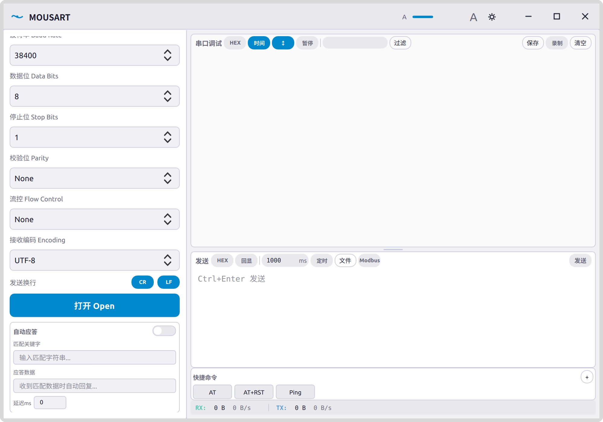
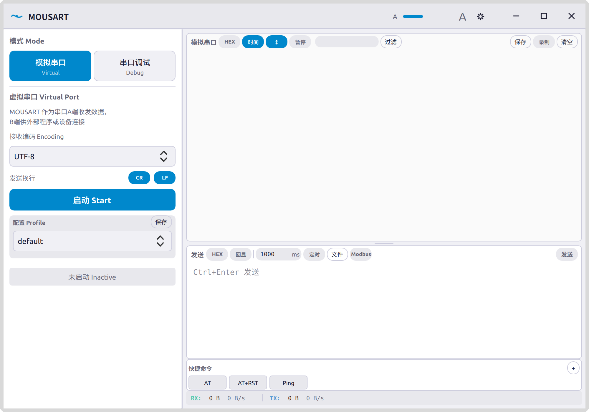

# MOUSART
## Outil de debogage serie complet

<div align="center">

**[简体中文](README.md)** | **[English](README.en.md)** | **[繁體中文](README.zh-TW.md)** | **[日本語](README.ja.md)** | **[한국어](README.ko.md)** | **[Deutsch](README.de.md)** | **[Español](README.es.md)** | **[Русский](README.ru.md)**

</div>

[](LICENSE)
[](https://github.com/kryntx/MOUSART/releases)
[](https://github.com/kryntx/MOUSART/releases/tag/v3.0.0)

**MOUSART** est un outil de debogage serie complet concu pour le developpe imbrique, le debogage materiel et les scenarios de communication serie. Il prend en charge deux modes independants : le debogage serie et le port serie virtuel, avec des dizaines de fonctionnalites professionnelles telles que la reponse automatique, le support du protocole Modbus, les commandes rapides, l'enregistrement et l'exportation de donnees, le controle des broches et le support multi-encodage.

---

## Captures d'ecran

### Mode debogage serie

<div align="center">
  
  <br>
  <em>Mode debogage serie - Connexion au port serie materiel pour l'envoi et la reception de donnees</em>
</div>

### Mode port serie virtuel

<div align="center">
  
  <br>
  <em>Mode port serie virtuel - Creation d'une paire de ports serie virtuels pour les programmes externes</em>
</div>

---

## Fonctionnalites

### Mode debogage serie
- Actualisation automatique de la liste des ports serie disponibles (scrutation toutes les 2 secondes)
- Support des adaptateurs USB-serie, Bluetooth serie, etc.
- Debit en bauds : 300 ~ 921600 valeurs predefinies + valeurs personnalisees (1-9999999)
- Bits de donnees : 5, 6, 7, 8 / Bits d'arret : 1, 1.5, 2
- Parite : None, Even, Odd, Mark, Space
- Controle de flux : Aucun / Materiel (RTS/CTS) / Logiciel (XON/XOFF)
- Controle manuel DTR/RTS
- Surveillance en temps reel des niveaux des broches CTS/DSR/DCD/RI
- Reponse automatique (correspondance de mots-cles + configuration du delai)

### Mode port serie virtuel (Linux uniquement)
- Creation en un clic d'une paire de ports serie virtuels basee sur `socat`
- Les programmes externes se connectent via `/tmp/mousart_vport`
- Zones d'envoi/reception independantes et statistiques

### Envoi et reception de donnees
- Basculement du mode d'envoi Texte / HEX
- Support multi-encodage : UTF-8, GBK, GB18030, Latin-1, ASCII
- Controle du saut de ligne a l'envoi (commutateurs independants CR / LF)
- Envoi temporise (1ms ~ 3600000ms)
- Envoi de fichier
- Constructeur de trames Modbus RTU (CRC automatique)
- Barre de commandes rapides (clic gauche envoyer, clic droit modifier)
- Raccourci clavier Ctrl+Enter pour envoyer

### Analyse de donnees
- Calcul de sommes de controle : Sum8 / XOR8 / CRC16-Modbus / CRC32
- Conversion binaire / decimal / hexadecimal
- Conversion Texte <-> Hex en temps reel
- Filtrage par mot-cle / expression reguliere

### Enregistrement de donnees
- Sauvegarde en un clic des journaux en TXT / CSV
- Enregistrement automatique (decoupage automatique a 10 Mo/fichier)
- Compteur d'octets RX/TX en temps reel et affichage du debit

### Interface
- Theme double sombre/clair
- Mise a l'echelle de la police 0.8x-1.5x
- Gestion des profils

---

## Guide d'installation

### Linux (Debian/Ubuntu)

#### Methode 1 : Installation du paquet deb (recommandee)

```bash
# 1. Telecharger le paquet deb
wget https://github.com/kryntx/MOUSART/releases/download/v3.0.0/mouserial_3.0.0-1_amd64.deb

# 2. Installer (les dependances sont installees automatiquement)
sudo apt install ./mouserial_3.0.0-1_amd64.deb

# 3. Executer
mousart
```

#### Methode 2 : Executer depuis le code source

```bash
# 1. Installer les dependances systeme
sudo apt update
sudo apt install python3-pyqt5 python3-serial socat git

# 2. Cloner le projet
git clone https://github.com/kryntx/MOUSART.git
cd MOUSART

# 3. Executer
python3 -m mousart
```

#### Methode 3 : Installer les dependances avec pip puis executer

```bash
# 1. Installer les dependances systeme
sudo apt install socat

# 2. Installer les dependances Python
pip3 install PyQt5 pyserial

# 3. Cloner et executer
git clone https://github.com/kryntx/MOUSART.git
cd MOUSART
python3 -m mousart
```

### Windows

#### Methode 1 : Executer depuis le code source

```bash
# 1. Installer Python 3.10+ (telecharger depuis python.org)

# 2. Installer les dependances
pip install PyQt5 pyserial

# 3. Cloner le projet et executer
git clone https://github.com/kryntx/MOUSART.git
cd MOUSART
python -m mousart
```

#### Methode 2 : Creer un EXE

```bash
# 1. Installer les dependances
pip install PyQt5 pyserial pyinstaller

# 2. Construire
pyinstaller pyinstaller.spec --noconfirm

# 3. Executer le dist/MOUSART.exe genere
```

---

## Guide de desinstallation

### Desinstallation du paquet deb Linux

```bash
# Methode 1 : Desinstaller avec apt
sudo apt remove mouserial

# Methode 2 : Desinstallation complete (y compris les fichiers de configuration)
sudo apt purge mouserial

# Nettoyer la configuration utilisateur (optionnel)
rm -rf ~/.mousart
rm -rf ~/mousart_logs
```

### Desinstallation de l'installation depuis le code source Linux

```bash
# Supprimer le repertoire du projet
rm -rf /path/to/MOUSART

# Nettoyer la configuration utilisateur (optionnel)
rm -rf ~/.mousart
rm -rf ~/mousart_logs
```

### Desinstallation Windows

```
# Supprimer le repertoire du projet

# Nettoyer la configuration utilisateur (optionnel)
# Supprimer le repertoire %USERPROFILE%\.mousart
# Supprimer le repertoire %USERPROFILE%\mousart_logs
```

---

## Guide d'utilisation

### Mode debogage serie
1. Dans le panneau de gauche, selectionnez le mode **"Debogage serie"**
2. Selectionnez le port serie dans la liste deroulante
3. Configurez les parametres du port serie (debit en bauds, bits de donnees, bits d'arret, parite, controle de flux)
4. Cliquez sur **"Ouvrir"** pour etablir la connexion
5. Saisissez les donnees dans la zone d'envoi a droite et cliquez sur **"Envoyer"** ou appuyez sur `Ctrl+Enter`
6. La zone de reception affiche les donnees recues en temps reel

### Mode port serie virtuel (Linux uniquement)
1. Dans le panneau de gauche, selectionnez le mode **"Port serie de simulation"**
2. Cliquez sur **"Demarrer"** pour creer la paire de ports serie virtuels
3. L'interface affiche le chemin du port externe `/tmp/mousart_vport`
4. Connectez-vous a ce chemin avec un outil serie quelconque
5. Saisissez les donnees dans la zone d'envoi et envoyez

### Commandes rapides
1. Cliquez sur **"+"** dans la barre de commandes rapides en bas pour ajouter une nouvelle commande
2. Saisissez le nom et les donnees (supporte le texte et le HEX)
3. Clic gauche sur le bouton de commande pour envoyer immediatement
4. Clic droit sur le bouton de commande pour modifier ou supprimer

### Reponse automatique (Mode debogage serie)
1. Trouvez la zone **"Reponse automatique"** dans le panneau de gauche
2. Activez le commutateur et configurez le mot-cle de correspondance et les donnees de réponse
3. Vous pouvez optionnellement configurer le delai de reponse (millisecondes)

### Construction de trame Modbus
1. Cliquez sur le bouton **"Modbus"** dans la barre d'outils d'envoi
2. Configurez l'adresse esclave, le code fonction, l'adresse de debut et la quantite
3. Cliquez sur **"Construire"** pour generer automatiquement une trame Modbus RTU avec CRC

### Enregistrement et exportation de journaux
1. Cliquez sur le bouton **"Enregistrer"** dans la barre d'outils de la zone de reception pour demarrer l'enregistrement automatique
2. Toutes les donnees envoyees et recues sont automatiquement sauvegardees dans `~/mousart_logs/`
3. Cliquez sur **"Sauvegarder"** pour exporter manuellement en TXT ou CSV

### Controle des broches (Mode debogage serie)
1. Apres l'ouverture du port serie, la barre de controle des broches s'affiche dans le panneau de gauche
2. Cliquez sur les boutons DTR/RTS pour basculer le niveau des broches
3. Les indicateurs d'etat CTS/DSR/DCD/RI s'affichent en temps reel

---

## Questions frequentes

**Q : Impossible d'ouvrir le port serie ?**
A : C'est generalement un probleme de permissions. Ajoutez l'utilisateur au groupe `dialout` :
```bash
sudo usermod -aG dialout $USER
# Deconnectez-vous et reconnectez-vous pour que cela prenne effet
```

**Q : Le port serie virtuel ne fonctionne pas ?**
A : Assurez-vous que `socat` est installe :
```bash
sudo apt install socat
```

**Q : Les caracteres chinois s'affichent de maniere incorrecte ?**
A : Selectionnez le bon encodage de reception dans le panneau de gauche (par ex. GBK).

**Q : Comment envoyer une commande Modbus ?**
A : Cliquez sur le bouton **"Modbus"**, remplissez les parametres et cliquez sur **"Construire"**. Les donnees de la trame seront automatiquement remplies dans la zone d'envoi.

**Q : Ou sont sauvegardes les fichiers d'enregistrement automatique ?**
A : Par defaut dans `~/mousart_logs/`, le format du nom de fichier est `mousart_rec_YYYYMMDD_HHmmss.log`.

---

## Licence

Ce projet utilise la **licence MIT** - voir [LICENSE](LICENSE) pour plus de details.

**MOUSART** - Rendre le debogage serie plus simple et plus efficace !
